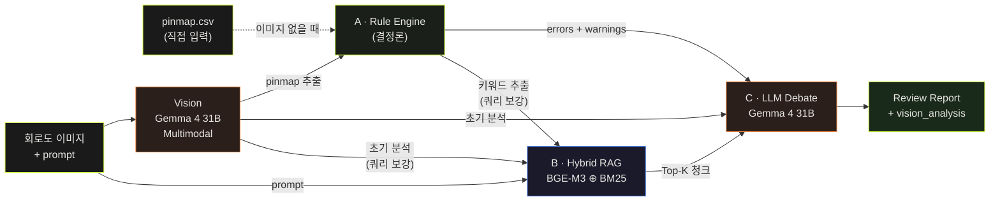
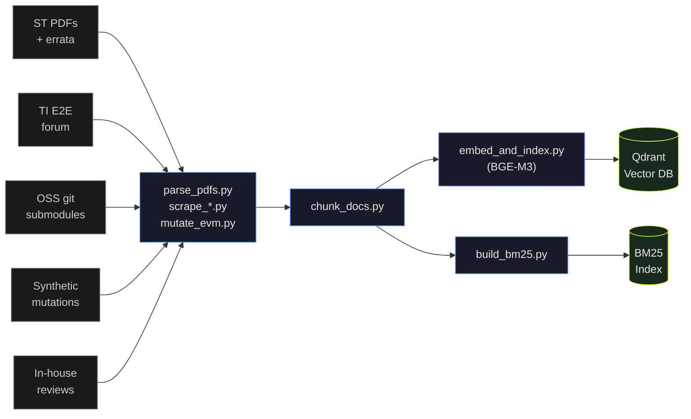

# MotorDriveForge — 시스템 아키텍처

> STM32G4 모터 드라이버 회로 검토 + CubeMX 코드 생성 자동화 파이프라인
> 운영: NVIDIA DGX Spark 128GB · 완전 로컬

---

## 전체 파이프라인

```mermaid
flowchart TD
    %% ============ INPUT ============
    INPUT["📥 USER INPUT<br/>회로도 이미지 + 자연어 프롬프트<br/>(선택: pinmap.csv 직접 입력)"]:::input

    %% ============ VISION ============
    VISION["👁️ Vision · 이미지 분석<br/>━━━━━━━━━━━━━<br/>Gemma 4 31B Multimodal<br/>회로도 → pinmap 자동 추출<br/>+ 초기 설계 분석 (한국어)"]:::llm

    %% ============ STEP 1 ============
    subgraph S1["STEP 1 · HW Review Agent"]
        direction TB

        A["🔧 A · Rule Engine (결정론)<br/>━━━━━━━━━━━━━<br/>Tier 1 · 전원 인프라 (VDD/VCAP/BOOT0)<br/>Tier 2 · 모터 논리 (PWM/BDTR/엔코더)<br/>Tier 3 · 페리페럴 예산 (OPAMP/DMA/AF)"]:::rule

        GATE{{"errors > 0 ?"}}:::gate

        FAST["⛔ 빠른 차단 모드<br/>HTTP 403 + 룰 결과 반환<br/>(CI / 자동검증 용)"]:::block

        B["🔍 B · Hybrid RAG Retrieval<br/>━━━━━━━━━━━━━<br/>쿼리 = 프롬프트 + 핀/페리페럴 키워드<br/>+ Rule Engine 결과(에러/워닝)<br/>+ Vision 초기 분석 (보강)<br/>━━━━━━━━━━━━━<br/>BGE-M3 (dense) ⊕ BM25 (sparse)<br/>→ Qdrant Top-K 청크"]:::rag

        C["🧠 C · LLM 검증<br/>━━━━━━━━━━━━━<br/>입력 컨텍스트:<br/>• 사용자 프롬프트 + pinmap<br/>• Vision 초기 분석<br/>• Rule Engine 결과 (전체)<br/>• RAG Top-K 청크<br/>━━━━━━━━━━━━━<br/>Backbone: Gemma 4 31B Dense (Q4_K_M)<br/>⚠️ 현재: 단일 LLM 호출 (페르소나 미구현)"]:::llm

        PERSONA["👥 5 Personas (설계 목표, 미구현)<br/>━━━━━━━━━━━━━<br/>① MCU/Periph  ② Motor Ctrl  ③ Power/EMI<br/>④ Safety/Failsafe  ⚖ Moderator<br/>━━━━━━━━━━━━━<br/>chunk_id 인용 강제 (미구현)"]:::persona

        REPORT["📋 Review Report (JSON)<br/>errors[] · warnings[] · suggestions[]<br/>+ vision_analysis (이미지 분석)<br/>+ evidence[chunk_id, source, quote]<br/>+ 자연어 설명 (신입용)"]:::output1
    end

    %% ============ GATE ============
    PASS{{"errors == 0?<br/>다음 단계 진행"}}:::gate

    %% ============ STEP 2 ============
    subgraph S2["STEP 2 · CubeMX Automation (LLM 없음)"]
        direction LR
        S2A["2.1<br/>.ioc 템플릿 수정"]:::cube
        S2B["2.2<br/>Headless CubeMX CLI"]:::cube
        S2C["2.3<br/>USER CODE 스니펫 주입"]:::cube
        S2D["2.4<br/>패키징 (ZIP)"]:::cube
        S2A --> S2B --> S2C --> S2D
    end

    %% ============ STEP 3 ============
    subgraph S3["STEP 3 · Algorithm Integration Agent"]
        direction TB
        S3LLM["💡 Glue 생성 LLM<br/>━━━━━━━━━━━━━<br/>Gemma 4 31B Dense (Q4_K_M)<br/>(Step 1과 동일 모델 단일 상주<br/>2026-06-10 모델 단일화)"]:::llm

        GOLD["📚 Golden Modules (5종)<br/>━━━━━━━━━━━━━<br/>foc_pmsm · dc_motor_pid<br/>bldc_6step_hall · fdcan_motor_cmd<br/>multi_axis_sync<br/>(검증된 C/H 레퍼런스)"]:::rag

        S3OUT["🔧 코드 적응 + 주입<br/>USER CODE BEGIN/END 사이<br/>(regen-friendly)"]:::output1

        S3LLM --> S3OUT
        GOLD --> S3LLM
    end

    %% ============ FINAL OUTPUT ============
    FINAL["📦 FINAL OUTPUT<br/>firmware.zip · review_report.md<br/>pinmap_validated.json · trace.json"]:::final

    %% ============ FLOW ============
    INPUT --> VISION
    INPUT -. "CSV 직접 입력<br/>(이미지 없을 때)" .-> A
    VISION -- "pinmap 추출<br/>+ 초기 분석" --> A
    VISION -. "초기 분석<br/>컨텍스트" .-> C
    A --> GATE
    GATE -- "errors > 0<br/>(빠른 차단 모드)" --> FAST
    GATE -- "pass / 풀 리뷰 모드" --> B
    A -.룰 결과 전달.-> C
    B --> C
    C --> PERSONA
    PERSONA --> REPORT
    REPORT --> PASS
    PASS -- "errors == 0" --> S2
    PASS -- "errors > 0" --> FAST
    S2D --> S3
    S3OUT --> FINAL

    %% ============ STYLES ============
    classDef input fill:#1a1a1a,stroke:#d4ff3a,stroke-width:2px,color:#e8e6e3
    classDef rule fill:#1a1f1a,stroke:#d4ff3a,stroke-width:1.5px,color:#e8e6e3
    classDef rag fill:#1a1a2a,stroke:#5a8fff,stroke-width:1.5px,color:#e8e6e3
    classDef llm fill:#2a1f1a,stroke:#ff8c42,stroke-width:1.5px,color:#e8e6e3
    classDef persona fill:#2a1a1a,stroke:#ff8c42,stroke-width:1px,color:#e8e6e3
    classDef gate fill:#2a2a1a,stroke:#d4ff3a,stroke-width:2px,color:#e8e6e3
    classDef block fill:#2a1414,stroke:#ff5050,stroke-width:2px,color:#e8e6e3
    classDef output1 fill:#1a2a1a,stroke:#d4ff3a,stroke-width:1.5px,color:#e8e6e3
    classDef cube fill:#1a1a2a,stroke:#5a8fff,stroke-width:1.5px,color:#e8e6e3
    classDef final fill:#1a1a1a,stroke:#d4ff3a,stroke-width:2.5px,color:#e8e6e3
```



---

## Step 1 상세 — 데이터 의존성

**Vision → A → B → C 순차 실행.** 이미지가 있을 때 Vision이 pinmap을 추출하고 그 결과가 전체 파이프라인의 입력이 됩니다.



**핵심 원칙:**
- Vision(Gemma 4 31B 멀티모달)이 회로도 이미지 → pinmap CSV + 초기 분석을 추출 (선택)
- 직접 CSV 입력이 있으면 CSV 우선, Vision 분석은 LLM 컨텍스트에만 포함
- Rule Engine 결과는 LLM 컨텍스트에 **항상** 포함됨 (LLM이 자연어 설명·후속 위험 추론 담당)
- RAG는 LLM의 입력을 augment하는 용도 — 단독으로 답 생성 안 함
- Rule Engine ERROR/WARNING 키워드 + Vision 분석을 RAG 쿼리에 반영해서 retrieval 품질 향상
- LLM 페르소나 토론은 **WARNING 영역과 판단형 항목**에서만 효과 — 결정론적 위반은 Rule Engine이 단독 처리

---

## Step 2 상세 — .ioc 생성 (결정론, LLM 없음)

```
확정 핀맵(mcu,chip,pin,io,label,function)
      │  ── 부품번호 디코드 → Mcu.Name/CPN/Package (_chip_identity)
      ↓
깡통 스켈레톤(_STATIC_IOC) + 식별자 주입
      │  ── 핀 신호 주입 (특수핀 풀네임, GPIOParameters, 중복/고아/SYS → GPIO 강등)
      │  ── 주변장치 자동 합성: TIM PWM/엔코더, ADC 채널, SPI, FDCAN, GPIO
      ↓
.ioc (CubeMX 로드 검증: LQFP·UFBGA)  ── 다중 MCU면 MCU별 1파일
      ↓
(CubeMX CLI headless 설치 시) → HAL 코드 ZIP
```

- 핵심: `backend/main.py::_build_ioc_content`. 핀 AF/풀네임/IO 데이터는 `agent/pin_options/`,
  `agent/pin_io_structure.json`(CubeMX DB·데이터시트 파생). 프론트 드롭다운도 동일 소스(`/v1/pin-options`).
- **BGA(UFBGA) 로드 함정**이 많아 깨지기 쉬움 — CLAUDE.md "Step 2" 항목 + 메모리 참조.

---

## 운영 모드 2가지

| 모드 | 트리거 | LLM 호출 | 사용처 |
|---|---|---|---|
| **빠른 차단 모드** | `mode=fast` 또는 CI 호출 | ❌ Rule Engine만 | 자동 검증, 게이트키퍼 |
| **풀 리뷰 모드** | `mode=full` (기본값) | ✅ A→B→C 전체 | 사람이 보는 리뷰 리포트 |

**왜 두 모드인가:** ERROR가 났어도 신입 설계자에겐 "왜 문제고 어떻게 고치라"는 자연어 설명이 더 가치가 큽니다. 빠른 차단은 CI 같은 자동화 흐름에만 쓰고, 사람이 받는 리포트는 풀 모드로.

---

## AI 모델 카탈로그

| 모델 | 역할 | 학습 / 소싱 | 메모리 |
|---|---|---|---|
| **Gemma 4 31B Dense** | Step 1 추론 백본 + **Step 3 glue 생성** (단일 모델) | `ollama pull gemma4:31b`, Apache 2.0 / Phase-2: QLoRA on 사내 리뷰 + 합성 데이터 | ~20 GB (Q4_K_M) |
| ~~Gemma 4 26B MoE~~ | ~~Step 3 초안~~ → **2026-06-10 단일화로 제거** | 미사용 (Gemma 4 31B로 통일) | — |
| **Qwen3-Coder 30B A3B** | Step 3 향후 A/B 후보 (glue 품질 이슈 시 검토) | HuggingFace, as-is | ~18 GB |
| **BAAI/bge-m3** | Dense 임베딩 | 사전학습, 다국어 / Phase-2: STM32 어휘 contrastive fine-tune (선택) | <2 GB |
| **BM25 (rank_bm25)** | Sparse retriever (TIM1_CH1N, PA8 같은 정확한 심볼 매칭) | 학습 없음, 인덱스만 | <1 GB |
| **5 Personas (prompt)** | MCU·Motor·Power·Safety·Moderator | 별도 가중치 없음, Gemma 4 31B 위 프롬프트 엔지니어링 | 0 |
| **Vision** | 회로도 이미지 → pinmap 추출 + 초기 분석 | Gemma 4 31B 멀티모달 (동일 인스턴스 재사용) | 포함 (31B와 공유) |

**Co-residency 검증:** Gemma 4 31B 단일 ~20 GB ≪ 128 GB 통합메모리 ✓ (2026-06-10 단일화)

---

## 지식 소스 카탈로그

| 소스 | 가치 | 상태 |
|---|---|---|
| ST 공식 PDF (RM/DS/AN) | STM32G4 페리페럴·핀 AF 정답 | ✅ 14건 인덱싱 완료 |
| **STM32G4 errata (ES0430 등)** | 실리콘 버그, 신입은 절대 모름 | ⚠ 명시적 추가 필요 (최우선) |
| **TI E2E motor-driver 포럼** | mock + reviewed 스키매틱 PDF 페어 = 지도학습 골드데이터 | ⚠ 크롤러 작성 필요 |
| OSS 레퍼런스 (ODrive/VESC/moteus 등) | 양산판 errata 노트, 실수 fix 커밋 이력 | ✅ submodule, 채굴 필요 |
| 스키매틱 에러 카탈로그 | "흔한 25개 실수" 류 → Rule Engine 후보 | 📝 텍스트 인덱싱 |
| **합성 망가진 스키매틱** | EVM × 12 mutation rules → 자동 라벨 데이터 | 🆕 최우선 자산 |
| 사내 리뷰 이력 | 팀 컨벤션, 신입 반복 실수 = 장기 해자 | 🔜 #circuit-review 채널 |
| CubeMX MCU XML DB | 핀 AF 권위 있는 출처 | ✅ parse_cubemx_xml.py |

---

## 데이터 인제스천 파이프라인 (오프라인)



요청 시점에는 실행되지 않고, 지식베이스 갱신할 때만 별도로 돕니다.
