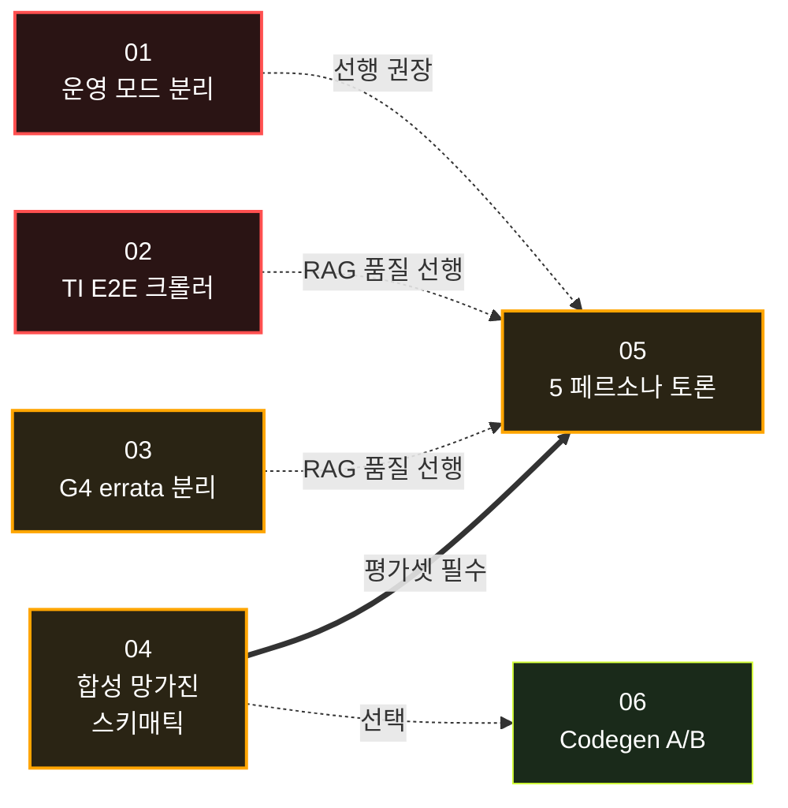

# Tasks Index

Claude Code로 작업할 때 이 순서로 진행하면 의존성 충돌 없습니다.

## 우선순위 & 의존성



## 작업 목록

| # | 제목 | 우선순위 | 예상 소요 | 의존성 |
|---|---|---|---|---|
| [01](./01_split_review_modes.md) | Step 1 운영 모드 분리 (fast/full) | 🔴 최우선 | 0.5–1d | 없음 |
| [02](./02_ti_e2e_crawler.md) | TI E2E 모터드라이버 포럼 크롤러 | 🔴 최우선 | 1–2d | 없음 |
| [03](./03_g4_errata_ingestion.md) | STM32G4 Errata 명시적 인제스천 | 🟡 높음 | 0.5d | 없음 |
| [04](./04_synthetic_broken_schematics.md) | 합성 망가진 스키매틱 파이프라인 | 🟡 높음 | 3–5d | 없음 |
| [05](./05_persona_debate.md) | 5 페르소나 토론 시스템 | 🟡 높음 | 2–3d | 04 필수, 02·03 권장 |
| [06](./06_codegen_benchmark.md) | Step 3 코드 생성 모델 A/B | 🟢 중간 | 1–2d | 없음 (04 활용 가능) |

## 권장 실행 순서

### Week 1 — 기반
1. **Task 01** — 운영 모드 분리 (가장 빠른 가치 제공)
2. **Task 03** — G4 errata 분리 (작은 작업, 즉시 RAG 품질 개선)
3. **Task 02** — TI E2E 크롤러 시작 (시간 걸리니 백그라운드)

### Week 2 — 데이터
4. **Task 02** 마무리, 인덱싱
5. **Task 04** 시작 — 시드 정규화 + mutation rules 구현

### Week 3 — 고도화
6. **Task 04** 마무리 — 평가셋 확보
7. **Task 05** — 페르소나 토론 (베이스라인 비교까지)
8. **Task 06** — Codegen 벤치마크 (Task 04와 병렬 가능)

## Claude Code 작업 시 권장 패턴

각 task 시작 시:

```
1. 해당 task 파일 + CLAUDE.md + ARCHITECTURE.md 읽기
2. 영향받는 기존 파일 읽기 (task 파일의 "관련 파일" 섹션)
3. 변경 계획 요약 후 작업
4. 테스트 실행
5. todo.md 업데이트 + 커밋
```

## 미래 작업 (별도 추적)

이 인덱스에 포함되지 않은 장기 항목:

- **QLoRA 학습** — Task 04 데이터 + 사내 리뷰 100건 수집 후
- **사내 리뷰 자동 아카이브** — Slack `#circuit-review` 채널 봇
- **스키매틱 이미지 입력** (Phase 2) — Auto-SPICE/EEschematic 패턴
- **React 프로덕션 UI** — Streamlit MVP 이후
- **Knowledge Graph 마이그레이션** — Rule Engine이 폭발적으로 늘어날 때
