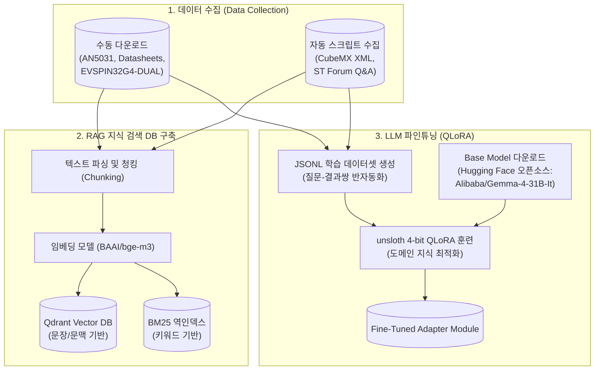
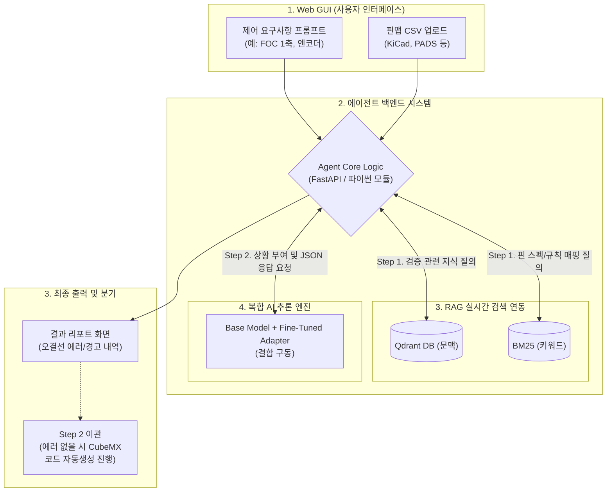

# STM32G4 HW 설계 검증을 위한 Step 1 Agent 계획서

> **목표**: 하드웨어 설계자(STM32G4 초보자)가 모터 구동 보드를 만들 때 흔히 하는 실수(핀 매핑 오류, 부팅 모드 누락 등)를 잡아주는 검증 설계 에이전트 구축.
> 완료 시점에는 웹 뷰어로 프롬프트와 핀맵을 입력하면 리포트가 출력되는 구조를 가져갑니다.

---

## 1. 기존 에이전트 리뷰와 새로운 방향성

### 기존 검증의 한계점
기존 계획은 CubeMX XML을 바탕으로 "이 핀이 이 기능을 할 수 있는가(Alternate Function 위주)"에 치중되어 있었습니다.
결과적으로 TIM1_CH1과 TIM2_CH1을 모터의 상·하단 스위치에 물리는 **논리적 회로 설계 오류**나, BOOT0 핀을 플로팅시켜 생기는 **부팅 오류** 같은 HW 실무적 관점의 치명적 결함은 잡기가 어려웠습니다.

### 새로운 방향성 (The "HW Expert" Agent)
1. **필수 인프라 검증**: 전원, VCAP, BOOT0, NRST, SWD(디버그) 등 시스템이 정상 시동되기 위한 핀과 결선이 올바르게 할당되었는지 최우선 확인.
2. **모터 제어 논리 검증**: 모터 구동을 위한 상보형(Complementary) PWM 쌍(예: TIM1_CH1 & TIM1_CH1N)과 데드타임 삽입 가능 여부 확인, 포텐셔미터 활용 또는 엔코더 전용 타이머 채널 맞물림 확인.
3. **페리페럴 제약 검증**: 아날로그 조작을 위한 단일 ADC 핀 올바른 할당 여부, 통신(FDCAN, UART) 핀 매핑 점검.

---

## 2. 수집해야 하는 데이터 가이드 (디렉토리 구조 기반)

향후 모델 학습 시 데이터의 출처를 쉽게 추적할 수 있도록, 디렉토리 구조에 맞추어 수집 방식(자동/수동/Git)을 체계적으로 분류했습니다.

```text
dataset/
├── official_docs/   (📌 수동 다운로드 - ST 캡차 정책 우회용)
│   ├── 하드웨어_데이터시트_및_가이드/ (RM0440, Datasheet, AN5031)
│   ├── 아날로그_통신_특화/ (AN5306, AN5346, AN5348, AN3070)
│   └── 모터구동_FOC_특화/ (UM2392, AN5166, EVSPIN32G4-DUAL 회로도)
├── forum_qa/        (📌 스크립트 자동/수동 기록)
│   └── st_forum_qa.jsonl (ST 포럼 질의응답 및 에러 사례 스크래핑 결과)
└── opensource/      (📌 자동 Git Clone 완료 - 완벽한 정답 레퍼런스)
    ├── Arduino-FOC/ (STM32G4 포팅된 SimpleFOC 소스)
    ├── flatmcu/     (STM32G473CB 기반 완전 공개 FOC 장비 KiCad 회로도)
    └── stm32-esc/   (B-G431B-ESC1 펌웨어 최적화 코드)
```

### [📁 dataset/official_docs/] (수동 다운로드 필요)
ST 홈페이지의 방화벽(HTTP/2 셧다운)을 피해, 로컬 PC 브라우저에서 아래 링크들을 클릭해 수동으로 다운로드하고 폴더에 정리합니다.
- **하드웨어 기초**: [RM0440](https://www.st.com/resource/en/reference_manual/rm0440-stm32g4-series-advanced-armbased-32bit-mcus-stmicroelectronics.pdf) / [G474 Datasheet](https://www.st.com/resource/en/datasheet/stm32g474re.pdf) / [AN5031(HW가이드)](https://www.st.com/resource/en/application_note/dm00445657-getting-started-with-stm32g4-series-hardware-development-stmicroelectronics.pdf)
- **아날로그 / 통신 (모터 핵심)**: [AN5306(OPAMP)](https://www.google.com/search?q=ST+AN5306+pdf) / [AN5346(ADC)](https://www.google.com/search?q=ST+AN5346+pdf) / [AN5348(FDCAN)](https://www.google.com/search?q=ST+AN5348+pdf) / [AN3070(RS485)](https://www.google.com/search?q=ST+AN3070+pdf)
- **FOC 제어 / 레퍼런스**: [UM3026 및 UM3027 (SDK v6 튜닝/보드 설정 통합 공식 문서 페이지)](https://www.st.com/en/embedded-software/x-cube-mcsdk.html#documentation) / [EVSPIN32G4 다축 회로도 (ST 로그인 필수/CAD Resources 탭)](https://www.st.com/en/evaluation-tools/evspin32g4-dual.html#cad-resources)

### [📁 dataset/forum_qa/] (자동 스크립트 기반/수동 대체)
- `scripts/scrape_st_forum.py` 커스텀 스크립트를 통해 에러 실패 사례를 JSONL(`st_forum_qa.jsonl`) 형식으로 자동 구축합니다. 
- (※ ST 커뮤니티 구조 변경으로 IP가 차단될 경우, 크롬 브라우저에서 찾은 에러 사례를 텍스트 파일로 해당 폴더에 수동으로 저장하여 보강합니다.)

### [📁 dataset/opensource/] (자동 Git Clone 완료 ✅)
단순한 문서를 넘어, 실제 컴파일 시 작동이 보증된 "정답지" 소스코드와 회로도 네트리스트가 포진된 결정적 디렉토리입니다. 로컬 Git Submodule로 이미 다운로드 연동이 완료되었습니다.
- **[Arduino-FOC]**: 다양한 환경에 포팅 가능한 STM32G4 핀 할당의 가장 범용적인 지침을 제공.
- **[flatmcu]**: STM32G473CB 기반 완전 공개 모델. 하드웨어 네트리스트 검증을 위해 KiCad 데이터를 파인튜닝 데이터로 변환하여 주입.
- **[stm32-esc]**: B-G431B-ESC1 보드 맞춤형 최적화 로직 및 주변 레지스터 세팅 추출용 데이터.

---

## 3. 학습(Fine-Tuning) 및 에이전트 구동 전략

단순히 수집된 문서를 프롬프트에 구겨넣는 것이 아니라, 효율적인 **RAG (검색 증강)**와 맞춤형 **QLoRA 파인튜닝**을 거쳐 전문가 수준을 달성합니다.

### A. 사용 모델 체급, 출처 및 인프라 구현 가능성 (Feasibility)
성공적인 시스템 구축을 위해서는 "주어진 사내 하드웨어로 실제로 모델 학습이 가능한가?"가 가장 중요합니다.

- **베이스 모델 출처**: `Google/Gemma-4` (환경에 맞춰 파라미터 사이즈 선택)
  - **선정 이유**: 사용자의 과거 프로젝트(뉴스 번역 등)에서 강력한 성능이 입증된 **Gemma 4**는 기존 모델들보다 압도적으로 거대한 지식망과 향상된 성능을 지니고 있으며, Qwen 대비 더 빠르고 정교한 코딩/Instruction 수행 능력을 보여줍니다.
  - **출처**: Hugging Face 개방형 오픈소스(Apache/Gemma 라이선스) 모델 트리를 다운로드하여 로컬망 안에서 폐쇄적으로 구동합니다.
- **수학적/하드웨어적 구현 가능성 (DGX Spark 128GB 활용)**:
  - 통상적으로 72B(720억 개 파라미터) 모델을 풀사이즈(16-bit)로 훈련하려면 150GB 이상의 VRAM이 필요해 불가능해 보일 수 있습니다.
  - 하지만 **4-bit 양자화(Quantization) 기반의 QLoRA 기법**을 사용하면 모델 로드에 약 40GB 초반, 훈련시 그래디언트 메모리를 합쳐도 총 **60~70GB의 VRAM 이내에서 여유롭게 파인튜닝이 구조적으로 가능**합니다. 
  - 현재 확보하신 **"DGX Spark (128GB 통합 메모리)" 인프라 규격 안에 완벽히 수용(Feasible)되는 아키텍처**입니다. 만약 속도를 더 높이고 싶다면 32B 모델로 다운그레이드하여 30GB VRAM 대역 안에서 최속 튜닝을 할 수도 있습니다.

### B. 데이터 추출 및 RAG(검색 증강) 체계 구축
사전에 데이터를 `BAAI/bge-m3` 임베딩 모델(다국어 및 코드 지원 임베딩)을 활용해 벡터 DB(Qdrant)에 적재합니다.
- **입력 데이터**: 위에서 수집된 PDF (텍스트 파싱) 및 포럼 에러 사례.
- **기대 효과**: 사용자가 "TIM1 1채널과 TIM2 1채널을 모터 상/하단 스위치로 써도 돼?"라고 물었을 때, 에이전트는 RAG를 거쳐 *Data Manual 24장 규칙*을 실시간으로 가져와 "상보 출력이 보장되지 않으므로 TIM1 CH1/CH1N 결선으로 바꾸라"고 답변을 제시하게 됩니다.

### C. 모델 파인튜닝 (QLoRA Fine-Tuning)
RAG만으로 잡기 힘든 **정형화된 JSON 리포트 응답 양식**이나 **체크리스트 순서화**를 에이전트 본연의 성격으로 내재화시키기 위한 단계입니다.
1. **데이터셋 세팅**: `scrape_st_forum.py`로 긁어온 모터 구동 에러 사례 + 모범 회로도를 바탕으로 `{"요청 프롬프트+핀맵" : "결과 리포트 JSON"}` 쌍의 JSONL 학습 데이터를 500~1000개 분량으로 생성합니다.
2. **학습 패키지 (unsloth Framework)**: DGX 128GB 서버 환경에서 메모리 사용량을 최소화하고 속도를 극대화할 수 있는 `unsloth` 프레임워크를 기반으로 GPU 상에서 4-bit QLoRA 코드를 실행합니다.
3. **훈련 목표**: 프롬프트가 들어왔을 때 딴 소리를 하지 않고, 우선순위대로 점검 -> 출력 JSON 생성이라는 행위를 모델 가중치(LoRA Adapter)에 못박습니다.
---

## 4. 최종 사용자 입출력 및 데이터 플로우 (UX / Data Flow)

어떤 데이터가 어떻게 들어가서, 시스템이 어떤 기법으로 검토를 거쳐 어떤 결괏값을 내주는지에 대한 구체적 명세입니다.

### [Phase 1] 사용자 입력 (User Input)
사용자는 웹 GUI 화면을 통해 다음 **2가지 데이터**를 동시에 입력합니다.
1. **자연어 요구사항 프롬프트 (Text)**
   - 예시: *"BLDC 모터 2개를 FOC 방식으로 구동할거야. 엔코더를 쓰고, 모터 간 통신을 위해 FDCAN을 쓸 예정이야. 그리고 과전류 보호를 위해 OPAMP 내장 기능도 쓸거야."*
2. **설계 핀맵 데이터 파일 (CSV 업로드)**
   - 예시: 하드웨어 설계 툴(KiCad, Altium, PADS 등)에서 추출한 보드의 Netlist 또는 Pin-Map CSV 파일. (어떤 핀이 어떤 네트(Net) 명칭과 물려있는지 명시된 파일)

### [Phase 2] 에이전트 다단 검토 (Processing via AI & RAG)
입력된 데이터는 에이전트 코어(`agent_core.py`)로 넘어가 다음 세 기법을 통해 교차 검증됩니다.
1. **데이터 전처리 (Python Parser)**
   - 업로드된 CSV를 파이썬 스크립트가 파싱하여 "PA8 = TIM1_CH1", "PB0 = BOOT0" 등의 정형화된 JSON 트리로 변환합니다.
2. **RAG (지식 검색) 기반 스펙 검토**
   - 사용자의 자연어(FDCAN, OPAMP)와 핀맵 키워드들을 추출해 **Qdrant(벡터 DB)** 와 **BM25(키워드 역인덱스 DB)** 에 던집니다.
   - DB는 앞서 우리가 다운로드한 공식 문서(AN5306, RM0440 등)와 포럼 실패 사례에서 **관련된 검증 룰(Rule)** 들만 실시간으로 뽑아옵니다. (예: *"FDCAN을 쓸 때는 OSC IN/OUT 핀에 반드시 외부 크리스탈이 연결되어야 함"* 이라는 룰 확보)
3. **거대 AI 추론 엔진 (Base Model + QLoRA 파인튜닝 어댑터)**
   - 파인튜닝된 **Gemma-4-31B 모델**에게 [사용자의 의도] + [변환된 핀맵 JSON] + [RAG가 찾아온 ST 공식 룰] 세 가지를 프롬프트로 융합하여 질문합니다.
   - 훈련된 모델은 *"전원/인프라 먼저 점검하고, 모터 상보 핀 쌍을 점검하고, 아날로그 충돌을 점검하라"*는 훈련된 사고 과정(Chain-of-Thought)을 거쳐 논리 결함을 잡아냅니다. 

### [Phase 3] 웹 리포트 출력 (Agent Output)
모델은 일상적인 긴 문장이 아닌, 시스템이 사전에 훈련시킨 **구조화된 JSON 템플릿** 양식으로 답변을 뱉어내며, 웹 UI가 이를 깔끔한 대시보드 리포트로 시각화하여 띄워줍니다.

**[출력 데이터 양식 예시]**
- **✅ PASS (정상)**: 전원(VDD, VCAP), 디버그(SWD) 등 기초 인프라 정상 연결.
- **🚨 Critical Errors (치명적 오류 - 작동 불가)**: 
  - *"모터 1의 상보 출력 중, 상단 스위치는 TIM1_CH1(PA8)에 연결됐으나 하단 스위치가 TIM2_CH1(PA0)에 연결되었습니다. 데드타임 삽입이 불가능해 쇼트 위험이 있습니다. 하단 스위치를 TIM1_CH1N(PA7)로 변경하세요."* (RAG-RM0440 타이머 규칙 적용)
- **⚠️ Warnings (경고 - 성능 저하 우려)**:
  - *"OPAMP 출력을 ADC로 내부 라우팅하도록 설계했는데, 아날로그 입력 저항 매칭이 최적화되어 있지 않습니다. (AN5306 PGA 규정 참조)"*
- **[다음 액션 분기]**: 치명적 오류가 0건(Zero)일 경우에만, 버튼이 활성화되며 **"Step 2: STM32CubeMX C 코드 자동생성 단계"** 로 정보를 넘길 수 있습니다.

---

## 5. 향후 진행 단계 (Step-by-Step)

새로운 목표를 반영하여, 현재 파일이 생성된 `work/` 디렉토리 하위에서 다음 단계로 차근차근 진행합니다.

1. **Step 1 (설계 확정)**: 현재의 `work/step1_agent_plan.md` 검토.
2. **Step 2 (검증 규칙 데이터 마이닝 파이프라인 구축)**: ST 공식 홈페이지와 포럼(`scrape_st_forum.py`)에서 다축 제어 보드 및 오류 사례 데이터를 긁어와서, LLM이 설계 룰을 자동 추출하는 파이프라인(`work/rule_extractor.py`)을 구동합니다.
3. **Step 3 (정적인 데이터 추출)**: 자동화 스크립트(`parse_cubemx_xml.py`)를 통해 AF 핀맵 DB JSON을 생성합니다.
4. **Step 4 (검증 LLM + 룰 로직 코딩)**: CSV 와 프롬프트를 입력받아 규칙들을 바탕으로 불량 결선을 찾아내는 Python 로직(`agent_core.py`)을 작성합니다.
5. **Step 5 (Web UI 붙이기)**: 잘 동작하는 파이썬 코드를 웹 프레임워크(FastAPI/Streamlit) 위에 올려 웹 뷰어를 완성합니다.

---

## 6. Agent 구축 및 구동 아키텍처 다이어그램

데이터 수집부터 최종 에이전트 구동까지의 과정을 **[Phase 1: 데이터 수집 및 학습모델 구축]**과 **[Phase 2: GUI 기반 실제 사용자 동작 플로우]** 두 단계로 나누어 설계했습니다.

### Phase 1: 데이터 수집 및 지식 베이스/학습 모델 구축 (Build-Time)
이 단계는 에이전트 모델과 RAG 데이터베이스를 만드는 초기 지식 주입 및 학습 과정입니다.



### Phase 2: 웹 GUI 기반 사용자 동작 파이프라인 (Run-Time)
구축된 모델(Adapter)과 RAG 데이터베이스(Qdrant, BM25)를 활용하여, 실제 하드웨어 설계자가 브라우저에서 핀맵과 프롬프트를 입력했을 때 에이전트가 점검하는 전체 플로우입니다.


