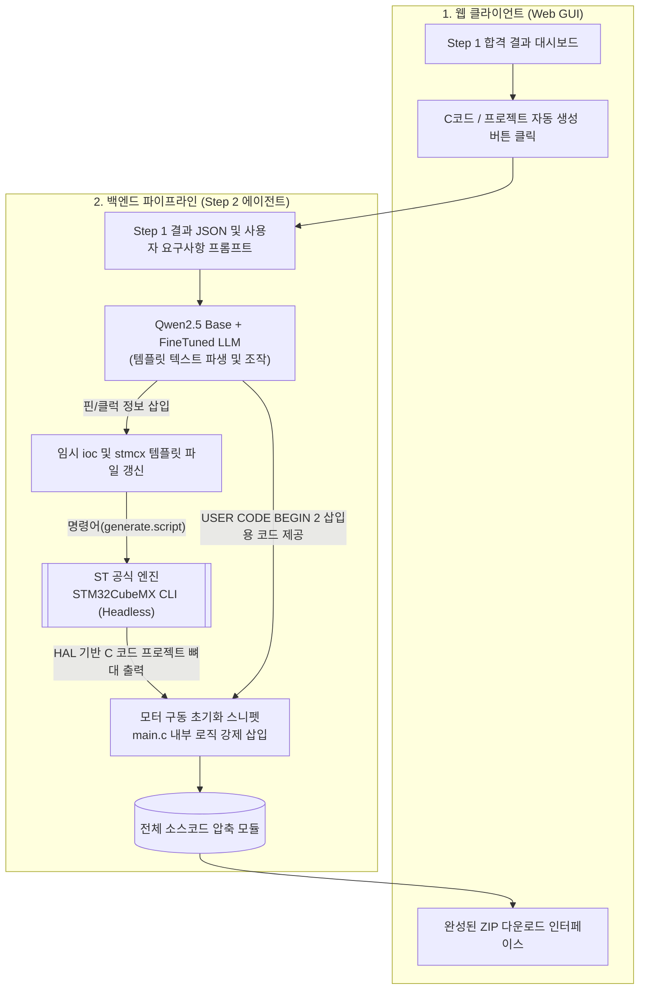
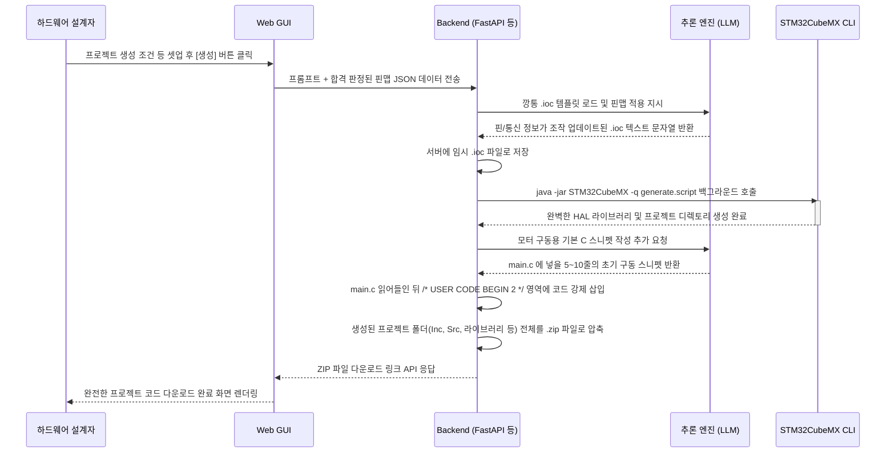

# STM32G4 HW 검증 기반 Step 2 Agent 계획서: C 코드 자동생성 파이프라인

> **목표**: Step 1에서 논리적 검증을 마친(패스한) 안전한 핀맵과 사용자 요구사항을 바탕으로, 오류 제로의 STM32 구동 초기화 파일(`.ioc` 및 `main.c` 프로젝트 팩)을 자동 생성하여 제공합니다.

---

## 1. 기존 LLM 코드 생성의 문제점과 해결책

### LLM의 쌩(Raw) C 코드 생성의 위험성
기존 챗GPT나 코딩 에이전트에게 "STM32G4 모터 구동 코드를 짜줘" 라고 하면, 클럭 트리나 레지스터 오프셋을 잘못 계산한 어설픈 레지스터(Register) 접근 코드나, 버전이 안 맞는 HAL 라이브러리 코드를 무작위로 짜주어 실제로 칩을 구동시키면 동작하지 않는 경우가 매우 많습니다.

### 🌟 해결책: STM32CubeMX CLI와 `.ioc` 템플릿의 결합
가장 안전한 방법은 AI가 C 코드를 직접 타이핑하는 것을 최소화하고, **ST의 공식 툴인 STM32CubeMX를 백그라운드 환경(명령어 기반 Headless)에서 조종하는 방식**입니다.
1. AI는 복잡한 C 코드가 아닌 텍스트 파일인 **`.ioc` 설정 파일**의 항목만 조작합니다.
2. 조작된 `.ioc` 파일을 ST의 공식 바이너리 툴이 해석하여 "문법적 오류가 전혀 없는 완벽한" HAL 라이브러리 C 코드를 뽑아냅니다.

---

## 2. 데이터 플로우 및 구동 파이프라인

### [1단계] Step 1 데이터 인계
- Step 1 검증을 마친 **전원/인프라/모터/통신 핀맵 JSON 트리가 Step 2 에이전트로 넘어옵니다.
- 프롬프트 상의 기능 요건(예: "FDCAN 속도 500k", "제어 주기 10kHz")도 파라미터화 되어 전달됩니다.

### [2단계] LLM의 지능적 `.ioc` 및 `.stmcx` 파일 스크립팅
- AI는 백엔드에 저장된 기본 STM32G4 빈 템플릿 파일(`.ioc`)을 엽니다.
- 넘어온 핀맵 데이터를 바탕으로 `.ioc` 파일에 아래와 같은 텍스트 라인들을 자동 삽입/수정 합니다:
  - `PA8.Locked=true`
  - `PA8.Signal=TIM1_CH1`
  - `PA8.GPIOParameters=GPIO_Speed,GPIO_PuPd`
  - `VP_SYS_VS_Systick.Mode=SysTick`
- 모터 제어 워크벤치가 필요한 경우 `.stmcx` 파일에도 동일하게 파라미터를 입력합니다.

### [3단계] 백엔드 코드 제네레이터 동작 (Headless CLI)
- AI가 텍스트 세팅을 완료하면 백엔드(리눅스 서버)가 ST의 공식 Generator를 터미널 커맨드로 구동합니다.
  - `> java -jar STM32CubeMX -q generate.script`
- 이 과정에서 `.ioc`를 바탕으로 물리적인 `main.c`, `stm32g4xx_hal_msp.c` 및 전체 폴더 트리가 서버에 구축됩니다.

### [4단계] 사용자 모터 로직 맞춤 삽입 (스니펫 생성)
- 깡통 초기화 코드만으로는 부족하므로, 체질이 개선(QLoRA 파인튜닝)된 LLM이 사용자 프롬프트에 맞춰 **모터 구동 핵심 스니펫**을 작성하여 `main.c`의 `/* USER CODE BEGIN 2 */` 영역에만 쏙 집어넣습니다.
  - 예: `HAL_TIM_PWM_Start(&htim1, TIM_CHANNEL_1);`
  - 예: `MC_StartMotor1();`

---

## 3. 웹 뷰어 (UX 흐름) 구상

**1. Step 1 결과 창에서 연결**
- 하드웨어 검증 결과가 모두 초록색(✅ PASS)일 경우에만, 화면 하단에 **[C 코드 / 프로젝트 자동 생성하기]** 버튼이 활성화됩니다. 클릭하여 Step 2로 진입합니다.

**2. 세부 초기화 파라미터 선택 뷰**
- 시스템 클럭(SysClk): (예: 170MHz 맥스 스피드 선택)
- RTOS 사용 여부: (예: FreeRTOS V2)
- 초기화 프레임워크: (단순 HAL 드라이버 구동 vs ST Motor Control SDK 적용안 구동)

**3. 코드 떨구기 (ZIP 다운로드 및 웹 에디터)**
- 사용자가 확인을 누르면, 벡엔드에서 위 2번 목차의 4단계 플로우가 10초 이내에 수행됩니다.
- 화면이 분할되며 왼쪽에는 생성된 주요 `main.c`의 뼈대가 하이라이팅되어 표시되고, 오른쪽에서는 **완전한 STM32IDE (또는 Keil/IAR) 패키지로 묶인 ZIP 파일 다운로드** 링크가 제공됩니다.

---

## 4. 필요한 개발 및 수집 요소 정리
이 Step 2를 구현하기 위해서는 추후 다음의 데이터와 환경 세팅이 필요합니다.
- 서버 환경에 리눅스용 `STM32CubeMX CLI` 패키지 설치.
- 빈 STM32G4 `.ioc` 텍스트 템플릿과 정규표현식 변환 파이썬 스크립트 작성.
- LLM에 넣을 "기본 구동 스니펫 C 코드" 예제 데이터셋 (다양한 드라이버 시작 커맨드 예제).

---

## 5. 아키텍처 블록 다이어그램 및 시퀀스 다이어그램

코드 자동 생성 기능이 어떻게 맞물려 돌아가는지 시각적인 구조와 시간적인 실행 순서를 명세합니다.

### A. 시스템 블록 다이어그램 (컴포넌트 구조)
웹 프론트엔드와 백엔드의 모듈들이 어떻게 연동되는지 보여줍니다. 핵심은 LLM이 C 코드를 짜는 것이 아니라, `.ioc` 파일을 조작하여 CubeMX 엔진을 가동시키는 구조입니다.

### B. 시퀀스 다이어그램 (시간별 동작 흐름)
사용자가 버튼을 클릭한 이후 서버 안에서 어떠한 과정들이 순서대로 일어나는지 구체적인 API 시간 흐름을 보여줍니다.

